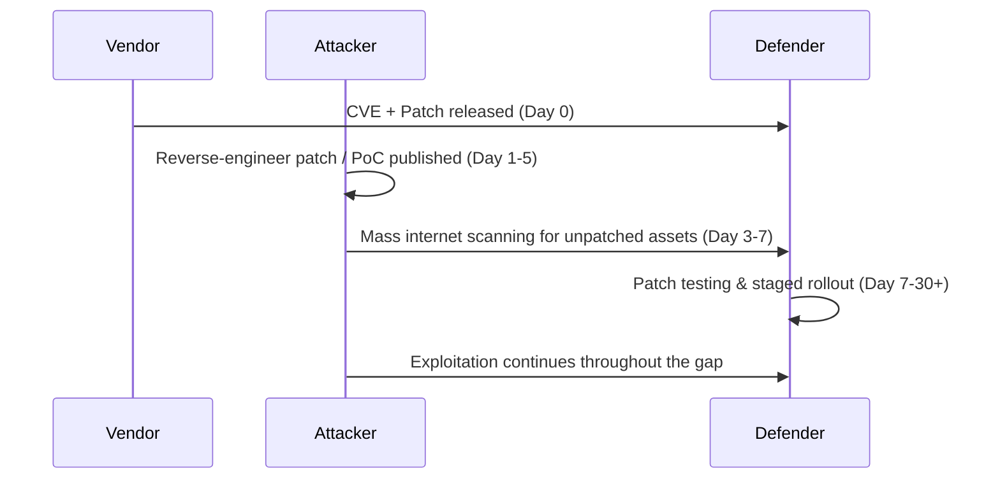

# Patch Management: The Most Underrated Control in Cybersecurity

**Oasis Infobyte Cybersecurity Internship — Task 6**
**Author:** Emmadi Nithin Reddy
**Focus:** Why patch management matters, what happens when it fails, and how to run it properly.

> [!NOTE]
> Most breaches in 2026 are not exotic zero-days. They are **known, already-patched vulnerabilities** that nobody got around to applying. This report is written from that angle — attacker workflow first, defender response second, fluff never.

---

## 1. What Patch Management Actually Is

Patch management is the continuous lifecycle of **identifying, testing, deploying, and verifying** fixes for known weaknesses in OS, applications, firmware, and third-party/open-source dependencies. It is not "running Windows Update occasionally." It is a security control with the same operational rigor as firewall rule management or IAM — asset inventory in, verified remediation out.

It exists because every piece of software ships with bugs, some of which are exploitable. A patch is the vendor closing a door that an attacker can walk through. The gap between "the door is publicly known to be open" and "you closed it" is where almost every modern breach happens.

---

## 2. Why It's Foundational, Not Optional

| Role in Security Posture | Explanation |
|---|---|
| Closes the most-used door | Vulnerability exploitation is now the **#1 initial access vector** for breaches — see Section 4. |
| Reduces attack surface without new tooling | Unlike buying an EDR or SIEM, patching is mostly cost-free — it's a process problem, not a budget problem. |
| Compliance baseline | ISO 27001, PCI-DSS, SOC 2, and HIPAA all explicitly require documented patch management — auditors check this first. |
| Shrinks the blast radius of everything else | A perfectly tuned SIEM still can't stop an attacker who walks in through a vulnerability that had a fix sitting unapplied for six months. |

> [!IMPORTANT]
> Patch management is the cheapest control with the highest ROI in the entire security stack — and consistently the worst-executed one. That mismatch is the entire reason this report exists.

---

## 3. The Attacker's Playbook (Offense-First View)

Think like the person trying to get in, not the person hoping to keep them out. Real attackers — and every major ransomware crew — follow this workflow:

1. **Recon / Enumeration** — Shodan, Censys, or mass `nmap -sV -sC` sweeps to fingerprint exposed services and exact software versions across IP ranges.
2. **CVE Mapping** — Cross-reference fingerprinted versions against NVD, CISA's KEV catalog, and public PoC repos (GitHub, ExploitDB, Nuclei templates). A vulnerable version number is an open invitation.
3. **Mass Weaponized Scanning** — Tools like Nuclei let an attacker test thousands of IPs against a single known CVE in minutes. This is how a single disclosed vulnerability turns into thousands of victims within days.
4. **Exploitation** — Initial access via the unpatched flaw, often chained with a second local privilege-escalation bug (also usually unpatched) to go from web-shell to domain admin.
5. **Industrialized Follow-Through** — Ransomware-as-a-service groups (Cl0p, LockBit, Lace Tempest) operationalize a single CVE across an entire victim pool simultaneously. Your unpatched server isn't just your problem — it's a line item in someone else's automated pipeline.

> [!WARNING]
> The "patch gap" — the time between a CVE/patch being published and an org actually applying it — is the single window attackers are racing to exploit. Public PoC code for critical RCEs routinely appears within 24–72 hours of disclosure.

---

## 4. The 2026 Threat Landscape: Patching Is Losing Ground, Not Gaining It

This isn't theoretical — it's the dominant trend in the most current industry data available.

| Metric (Verizon 2026 DBIR, incidents Nov 2024–Oct 2025) | Value |
|---|---|
| Breaches starting with vulnerability exploitation | **31%** — now the #1 initial access vector, overtaking stolen credentials (13%) for the first time in the report's 19-year history |
| CISA KEV vulnerabilities fully remediated in 2025 | **26%** (down from 38% the year prior) |
| KEV vulnerabilities only partially remediated | 58% |
| KEV vulnerabilities left fully unaddressed | 16% |
| Median time-to-patch | **43 days** (up from 32 days — a 34% increase) |
| Year-over-year growth in must-patch (KEV) volume | ~50% more critical CVEs to patch than the previous year |
| Breaches involving ransomware | 48% (up from 44%) |

The reason patching is getting *worse*, not better, despite more tooling: the volume of disclosed and actively-exploited vulnerabilities is growing faster than security teams' capacity to triage and remediate them — accelerated further by AI-assisted vulnerability discovery on both the offensive and defensive side. CISA itself rewrote its federal patching policy in 2026 (BOD 26-04, "Prioritizing Security Updates Based on Risk") moving away from blanket deadlines toward strict risk-based triage — a tacit admission that "patch everything fast" no longer scales.

> [!CAUTION]
> Patch management in 2026 is as much a **capacity and prioritization problem** as a technical one. Scanning more isn't the bottleneck anymore — deciding what to fix first, and actually shipping the fix, is.

---

## 5. Real-World Consequences of Failing to Patch

Dual perspective on each case: what the attacker exploited, and what the defender should have done differently.

| Incident | Vulnerability | Patch Available Before Exploitation? | Attacker Side | Defender Failure | Impact |
|---|---|---|---|---|---|
| **WannaCry** (2017) | MS17-010 / EternalBlue (SMBv1 RCE) | Yes — ~2 months prior | Leaked NSA exploit weaponized into a self-propagating worm | Mass unpatched SMBv1, especially across NHS infrastructure | 200,000+ systems across 150 countries; NHS disruption alone cost an estimated £92M |
| **Equifax** (2017) | CVE-2017-5638, Apache Struts2 RCE | Yes — ~2 months prior | OGNL injection via a public-facing dispute-resolution portal | Known vulnerable component never inventoried or patched | 147 million records exposed; ~$1.4B in settlements and costs |
| **Log4Shell** (2021) | CVE-2021-44228, Log4j RCE | No — zero-day, patched same week | Trivial JNDI-lookup RCE, mass internet scanning within hours of disclosure | Log4j buried inside nested third-party dependencies — most orgs didn't know they had it | Affected nearly every Java-based enterprise application globally |
| **MOVEit / Cl0p** (2023) | CVE-2023-34362, SQLi in MOVEit Transfer | Exploited as zero-day, attacks continued post-patch | Cl0p ransomware group automated mass exploitation across thousands of internet-facing instances | Slow patch cycles on a third-party SaaS file-transfer tool | 2,700+ organizations, 95M+ individuals affected |
| **PaperCut (Lace Tempest)** | CVE-2023-27351, auth bypass | Patch available since April 2023 | Lace Tempest used it to deploy **Cl0p and LockBit** ransomware | Still found unpatched in live environments — **re-added to CISA's KEV catalog in 2026**, three years later | Proof that patch debt compounds rather than disappears |
| **Zimbra Collaboration Suite (UAC-0233)** | CVE-2025-48700 / CVE-2025-66376 | Patches issued; exploitation continued regardless | State-linked actor harvested mailbox contents, MFA backup codes, address books since Sept 2025 | Internet-facing mail server left unpatched/unmonitored | Targeted Ukrainian government and critical-sector entities |

> [!NOTE]
> The PaperCut case is the most important row in that table. It isn't a sophisticated attack — it's a **three-year-old, fully patchable bug** still being exploited in 2026. That's not a technology failure. That's a process failure.

### Cost of Getting This Wrong

From IBM's *Cost of a Data Breach Report 2025*:

| Metric | Value |
|---|---|
| Global average cost of a data breach | $4.44M |
| US average cost (record high) | $10.22M |
| Healthcare average cost (14th consecutive year as highest) | $7.42M |
| Average time to identify and contain a breach | 241 days |

---

## 6. The Defender's Playbook (Blue Team View)

Patching can't always happen instantly — testing windows, change-control freezes, and legacy dependencies are real constraints. The job of defense is to **shrink and survive the gap**, not pretend it doesn't exist.

| Control | Purpose |
|---|---|
| Authenticated vulnerability scanning (Nessus, Qualys, OpenVAS) tied to a real asset inventory | You cannot patch what you don't know exists — this is the #1 root cause of missed patches |
| EPSS + CISA KEV-aware prioritization, not CVSS alone | CVSS measures *severity*; EPSS + KEV membership measures *actual exploitation likelihood* — patch what's being used in the wild first |
| Detection signatures for known exploit patterns (e.g., Log4j JNDI callbacks, Struts OGNL injection) | Buys time during the patch gap by catching exploitation attempts even before the patch is deployed |
| Virtual patching — WAF rules, IPS signatures, feature disabling, network segmentation | Compensating control when the real patch isn't ready or is still in testing |
| Staged rollout: canary → pilot → full fleet | Prevents a bad patch from becoming its own outage (see the global CrowdStrike update incident of 2024 — a cautionary tale about *how* you deploy, not just *whether* you patch) |
| Software Composition Analysis (SCA) for dependencies | Catches buried transitive vulnerabilities like Log4j before they ship in your own software |

---

## 7. Best Practices for an Effective Patch Management Strategy

A workflow, not a checklist — each step feeds the next:

1. **Asset Inventory & Discovery** — Automated, agent + agentless. Include shadow IT, IoT, and third-party SaaS dependencies. This step alone prevents most "we didn't know that server existed" incidents.
2. **Continuous Vulnerability Scanning** — Authenticated scans + SCA on code dependencies, not just OS-level patching.
3. **Risk-Based Prioritization** — Combine CVSS score, EPSS probability, CISA KEV membership, exploit/PoC availability, and asset exposure (internet-facing vs. internal) into one ranked queue.
4. **Patch Testing** — Staging environment, canary group, documented rollback plan before any production-wide push.
5. **Deployment Automation** — Don't rely on manual patching at scale. Use centralized tooling (table below).
6. **Verification & Closed-Loop Reporting** — Rescan after deployment. A closed ticket is not proof of remediation; a clean rescan is.
7. **Emergency Out-of-Band Process** — A separate, fast-tracked SLA specifically for actively-exploited (KEV-listed) vulnerabilities on internet-facing assets.
8. **Documentation & Audit Trail** — Required for ISO 27001 / PCI-DSS / SOC 2 compliance and essential for post-incident forensics.

### Suggested SLA Tiers

| Severity | Example | Target Remediation SLA |
|---|---|---|
| Critical & actively exploited (KEV-listed) | Unauthenticated RCE on an internet-facing asset | 24–72 hours |
| Critical (CVSS 9.0–10.0) | Unauthenticated RCE, no known exploit yet | ≤ 7 days |
| High (CVSS 7.0–8.9) | Privilege escalation, SQLi | ≤ 30 days |
| Medium (CVSS 4.0–6.9) | Information disclosure | ≤ 90 days |
| Low (CVSS < 4.0) | Minor misconfiguration | Next scheduled maintenance cycle |

### Tooling Reference

| Category | Tools |
|---|---|
| Vulnerability Scanning | Nessus, Qualys VMDR, OpenVAS, Rapid7 InsightVM |
| Patch Deployment — Windows | WSUS, Microsoft Intune/SCCM, ManageEngine Patch Manager Plus |
| Patch Deployment — Linux | `apt`/`yum`/`dnf` orchestrated via Ansible, Puppet, or Chef |
| Container / Cloud-Native | Trivy or Grype for image scanning; rebuild-the-image rather than patch-the-running-container; AWS Systems Manager Patch Manager |
| Risk Prioritization Feeds | CISA KEV catalog, FIRST.org EPSS scores, NVD CVSS |
| Catch It Before It Ships (SCA/SAST) | Snyk, GitHub Dependabot, OWASP Dependency-Check |

---

## 8. Quick Revision Summary

| Concept | One-Line Takeaway |
|---|---|
| Patch Management | Continuous identify → test → deploy → verify cycle for known vulnerabilities |
| #1 stat to remember | Vulnerability exploitation = 31% of breaches (2026 DBIR) — now ahead of stolen credentials |
| The Patch Gap | Window between disclosure/patch release and actual deployment — this is what attackers race to exploit |
| CISA KEV Catalog | List of CVEs with *confirmed* real-world exploitation — patch these before anything else |
| EPSS | Predicts exploitation probability in the next 30 days — sharper prioritization than CVSS alone |
| Virtual Patching | Compensating control (WAF/IDS rule, segmentation) when the real patch can't be deployed yet |
| Biggest real-world failure mode | Not unknown zero-days — known, already-patched CVEs left unapplied for months or years (see: PaperCut, 2023→2026) |

---
## 9.Risks of Unpatched Systems

Organizations that fail to apply security patches expose their systems to significant cybersecurity risks. Attackers actively scan the internet for devices running outdated software because known vulnerabilities often have publicly available exploit code. Unpatched systems can lead to:

* Remote Code Execution (RCE) attacks
* Unauthorized access to sensitive information
* Ransomware infections
* Data breaches and financial losses
* Service disruptions and downtime
* Compliance violations and legal penalties
* Reputation damage and loss of customer trust

Several high-profile incidents, including WannaCry, Equifax, and MOVEit, demonstrate that delayed patching can result in large-scale security compromises affecting millions of users.

---

## 10.Benefits of Keeping Software Up to Date

Regularly updating operating systems, applications, and firmware strengthens an organization's security posture by eliminating known vulnerabilities before attackers can exploit them. Effective patch management provides several benefits:

* Reduces the attack surface
* Protects against known exploits
* Improves system stability and reliability
* Ensures compliance with security standards and regulations
* Enhances overall cybersecurity resilience
* Minimizes downtime caused by security incidents
* Supports business continuity by reducing operational risks

Keeping software up to date is one of the most effective and cost-efficient cybersecurity practices for protecting modern IT environments.

## 11. Conclusion

Patch management doesn't fail because organizations lack tooling — it fails because prioritization, testing discipline, and follow-through verification get skipped under time pressure. The 2026 data is unambiguous: attackers have shifted decisively toward exploiting known, often already-patched vulnerabilities, because doing so is faster, cheaper, and more reliable than social engineering at scale. A mature patch management program — asset inventory, risk-based triage using EPSS/KEV rather than CVSS alone, staged deployment, and closed-loop verification — remains the single highest-leverage control available to any security team, regardless of budget size.

---

## References

- CISA Known Exploited Vulnerabilities (KEV) Catalog — https://www.cisa.gov/known-exploited-vulnerabilities-catalog
- CISA Binding Operational Directive 26-04 — https://www.cisa.gov/news-events/directives/bod-26-04-prioritizing-security-updates-based-risk
- Verizon 2026 Data Breach Investigations Report — https://www.verizon.com/business/resources/reports/dbir/
- IBM Cost of a Data Breach Report 2025 — https://www.ibm.com/reports/data-breach
- The Hacker News — *CISA Adds 8 Exploited Flaws to KEV* (Apr 2026) — https://thehackernews.com/2026/04/cisa-adds-8-exploited-flaws-to-kev-sets.html
- CERT-UA H2 2025 Report on Zimbra/UAC-0233 activity (via The Hacker News coverage)
