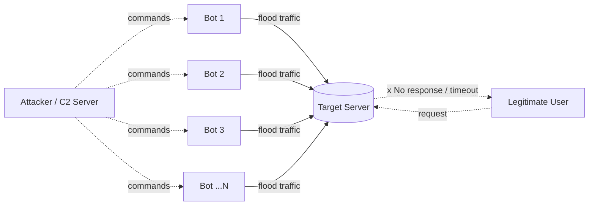
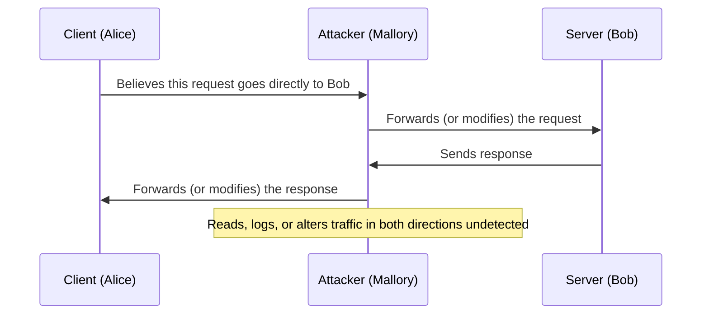
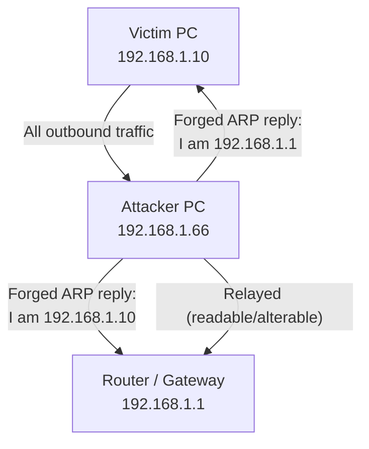
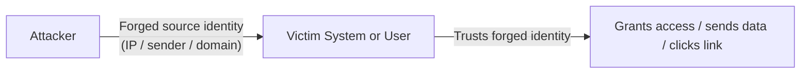

# Common Network Security Threats: DoS/DDoS, Man-in-the-Middle, and Spoofing Attacks

**A Research Report on Network Security Threats and Countermeasures**

| | |
|---|---|
| **Author** | Emmadi Nithin Reddy |
| **Task** | Task 4 — Research Report on Common Network Security Threats |
| **Scope** | DoS/DDoS attacks, Man-in-the-Middle (MITM) attacks, Spoofing attacks |
| **Date** | June 2026 |

---

## Table of Contents

1. [Executive Summary](#1-executive-summary)
2. [Introduction](#2-introduction)
3. [Denial of Service (DoS) and Distributed Denial of Service (DDoS) Attacks](#3-denial-of-service-dos-and-distributed-denial-of-service-ddos-attacks)
4. [Man-in-the-Middle (MITM) Attacks](#4-man-in-the-middle-mitm-attacks)
5. [Spoofing Attacks](#5-spoofing-attacks)
6. [Comparative Analysis](#6-comparative-analysis)
7. [Defense-in-Depth: General Best Practices](#7-defense-in-depth-general-best-practices)
8. [Conclusion](#8-conclusion)
9. [References](#9-references)

---

## 1. Executive Summary

Network security threats remain one of the most persistent risks to modern digital infrastructure. This report examines three foundational categories of network attacks — **Denial of Service (DoS/DDoS)**, **Man-in-the-Middle (MITM)**, and **Spoofing** — covering how each threat operates technically, the real-world damage they have caused, and the layered defenses organizations use to mitigate them. While these three categories are often taught separately, in practice they frequently overlap: spoofing techniques are commonly used to *enable* both DDoS amplification and MITM positioning. Understanding this overlap is as important as understanding each threat individually.

---

## 2. Introduction

Almost every network attack can be mapped back to one (or more) of the three pillars of the **CIA Triad** — Confidentiality, Integrity, and Availability:

| Threat | Primary CIA Pillar Targeted | One-line Description |
|---|---|---|
| DoS / DDoS | **Availability** | Floods or exhausts a system so legitimate users cannot use it |
| MITM | **Confidentiality & Integrity** | Secretly intercepts and possibly alters communication between two parties |
| Spoofing | **Integrity & Authentication** | Forges identity (IP, MAC, DNS, email, certificate) to gain unearned trust |

These three are not isolated silos. A real-world incident often chains them together — for example, an attacker might **spoof** a source IP to bypass an access control list, use that position to mount a **MITM** attack on a victim's traffic, and if detected, fall back to a **DoS** attack to disrupt monitoring or incident response. Recognizing these threats individually — and recognizing how they combine — is core to both offensive (red team) and defensive (blue team) security work.

> [!NOTE]
> This report uses an attacker-and-defender lens for each threat: **how it works** (offensive mechanics), **what it costs** (impact), **how it's been used in the wild** (real incidents), and **how it's stopped** (mitigation and detection).

---

## 3. Denial of Service (DoS) and Distributed Denial of Service (DDoS) Attacks

### 3.1 What It Is

A **Denial of Service (DoS)** attack attempts to make a service unavailable to its intended users by overwhelming the target's network bandwidth, server resources, or application logic — from a *single* source. A **Distributed Denial of Service (DDoS)** attack is the same goal achieved using *many* distributed sources simultaneously, typically a **botnet** of compromised machines (computers, routers, IoT cameras, DVRs, etc.) acting under a single attacker's command-and-control (C2) infrastructure.

### 3.2 Categories of DoS/DDoS Attacks

| Category | Layer | Mechanism | Example Techniques |
|---|---|---|---|
| **Volumetric** | Network (L3/L4) | Saturate available bandwidth with raw traffic volume | UDP flood, ICMP/ping flood, DNS/NTP/Memcached amplification |
| **Protocol** | Network/Transport (L3/L4) | Exhaust server or network-equipment state tables | SYN flood, Smurf attack, Ping of Death, fragmented packet attacks |
| **Application-Layer** | Application (L7) | Exhaust application resources with seemingly legitimate requests | HTTP flood, Slowloris (slow, incomplete connections), API abuse |

### 3.3 How It Works — Attacker Workflow

1. **Build or rent capacity** — compromise IoT/end-user devices to form a botnet, or rent a "DDoS-for-hire" / booter service.
2. **Select a vector** — volumetric flood, protocol exhaustion (e.g., SYN flood leaves half-open TCP connections), or application-layer exhaustion.
3. **Optionally spoof the source IP** — for *reflection/amplification* attacks, the attacker forges the victim's IP as the "source" of small requests sent to open, unauthenticated UDP services (DNS resolvers, NTP servers, memcached instances). Those services then send much larger responses *to the victim*, achieving massive amplification from minimal attacker bandwidth.
4. **Launch and sustain** — traffic is directed at the target until bandwidth, connection tables, or application threads are exhausted.
5. **(Sometimes) Use the outage as a distraction** — DDoS is occasionally used to draw security teams' attention away from a simultaneous data breach.

### 3.4 Impact

- **Service downtime** — direct revenue loss for e-commerce, SLA breaches for SaaS providers.
- **Reputational damage** — customer trust erodes when a platform is repeatedly unreachable.
- **Operational cost** — incident response, emergency bandwidth/scrubbing capacity, post-incident hardening.
- **Secondary risk** — DDoS can mask a parallel intrusion or data exfiltration attempt.

### 3.5 Real-World Examples

**Mirai Botnet → Dyn DNS (October 21, 2016).** The Mirai malware scanned the internet for IoT devices — cameras, DVRs, home routers — still using factory-default credentials, and conscripted roughly a hundred thousand of them into a botnet. On October 21, 2016, that botnet launched three waves of DDoS traffic at Dyn, a major DNS provider. Because so many platforms depended on Dyn to resolve their domain names, the attack rippled outward and made dozens of major sites — including Twitter, Reddit, Netflix, PayPal, Spotify, and GitHub — unreachable across the U.S. and parts of Europe for several hours. The incident is widely credited with putting IoT device security on the mainstream security agenda, since the "bots" were ordinary consumer hardware rather than traditional infected PCs.

**Memcached Amplification → GitHub (February 28, 2018).** Attackers discovered that many internet-exposed **memcached** caching servers would respond to unauthenticated UDP requests on port 11211 with replies tens of thousands of times larger than the request — an amplification factor reported as high as ~51,000:1. By spoofing GitHub's IP address as the "source" of tiny requests to thousands of these misconfigured servers, attackers caused a flood of amplified responses to hit GitHub directly, peaking at **1.35 Tbps and 126.9 million packets per second** — more than double the size of the Mirai/Dyn attack and, at the time, the largest publicly recorded DDoS attack. GitHub survived with only a few minutes of intermittent unavailability because it had pre-arranged scrubbing capacity through Akamai and automatically rerouted traffic once anomaly detection triggered. Notably, this attack required **no botnet at all** — just spoofed packets and exposed servers, illustrating how IP spoofing directly enables DDoS amplification.

### 3.6 Detection (Blue Team Perspective)

- **Traffic baselining** — establish a normal traffic profile per service so deviations (sudden spikes, unusual protocol mixes) trigger alerts.
- **Ingress/egress ratio monitoring** — a sharp imbalance between inbound and outbound traffic is a classic volumetric-attack signature (this is exactly how GitHub's monitoring first flagged the 2018 attack).
- **Half-open connection counts** — a flood of SYN packets without completed handshakes indicates a SYN flood.
- **NetFlow/sFlow analysis** — identify traffic arriving from an abnormally large number of distinct source IPs or autonomous systems (ASNs) at once.
- **Application-layer monitoring** — track request latency, thread/connection pool exhaustion, and abnormal request patterns (e.g., many slow, incomplete HTTP requests indicate Slowloris-style attacks).

### 3.7 Mitigation and Prevention

| Defense | Purpose |
|---|---|
| **Anycast + CDN / scrubbing providers** (e.g., Cloudflare, Akamai) | Absorb and filter volumetric traffic across a globally distributed edge before it reaches origin servers |
| **Rate limiting & connection throttling** | Cap requests per source to blunt application-layer floods |
| **SYN cookies** | Avoid allocating server state until the TCP handshake is verified, defeating SYN floods |
| **BCP 38 / Ingress-Egress Filtering (anti-spoofing)** | ISPs and network operators drop packets with forged source IPs, preventing reflection/amplification abuse at the source |
| **Disabling/hardening exposed UDP services** | Memcached, NTP, and open DNS resolvers should never be open to the public internet without authentication |
| **Web Application Firewall (WAF)** | Filters malicious or abnormal application-layer requests |
| **Black-hole / null routing & upstream coordination** | Temporarily discard traffic to a target IP, or work with upstream ISPs to filter at the network core |
| **Redundancy & load balancing** | Distribute load across multiple regions/data centers so no single point of failure exists |

### 3.8 Quick Revision Card

| Term | Definition |
|---|---|
| DoS | Single-source attack to deny service availability |
| DDoS | Distributed, multi-source version using a botnet |
| Amplification/Reflection | Spoofed small request → large response directed at victim |
| SYN flood | Half-open TCP connections exhaust server state |
| Slowloris | Many slow/incomplete HTTP connections exhaust threads |
| Key real-world cases | Mirai → Dyn (2016, IoT botnet); Memcached → GitHub (2018, 1.35 Tbps, no botnet) |
| Top defense | CDN/scrubbing + ingress filtering (BCP 38) + rate limiting |

---

## 4. Man-in-the-Middle (MITM) Attacks

### 4.1 What It Is

A **Man-in-the-Middle attack** occurs when an attacker secretly positions themselves between two communicating parties — intercepting, and optionally altering, traffic that each party believes is going directly to the other. Unlike DoS, the goal here isn't disruption; it's **silent access** to data in transit (credentials, session tokens, financial data) or **silent manipulation** of that data.

### 4.2 Common Techniques

| Technique | Layer | Mechanism |
|---|---|---|
| **ARP Spoofing/Poisoning** | Local network (L2) | Forge ARP replies so traffic meant for the gateway/victim flows through the attacker |
| **DNS Spoofing/Cache Poisoning** | Application (L7) | Trick a resolver or victim into accepting a forged DNS response, redirecting them to an attacker-controlled server |
| **Rogue Wi-Fi / "Evil Twin" Access Point** | Wireless | Attacker broadcasts a fake AP impersonating a trusted network, capturing all client traffic |
| **SSL Stripping / Downgrade Attacks** | Transport | Silently force a connection from HTTPS down to unencrypted HTTP |
| **Session Hijacking** | Application | Steal a valid session cookie/token to impersonate an authenticated user |
| **BGP Hijacking** | Internet routing (L3, global) | Announce false routes so internet-scale traffic is misdirected through attacker infrastructure |
| **Rogue/Fraudulent Certificates** | PKI / Application | Compromise or trick a Certificate Authority into issuing a valid-looking certificate for a domain the attacker doesn't own |

**ARP spoofing in particular** is the most common way to achieve MITM positioning on a local network:

### 4.3 How It Works — Attacker Workflow

1. **Achieve positioning** — get onto the same LAN segment (e.g., via ARP poisoning or a rogue access point), or gain routing-level influence (BGP hijack), or compromise a trust anchor (a Certificate Authority).
2. **Intercept traffic** — once positioned, all or some of the victim's traffic physically or logically flows through the attacker.
3. **Optionally decrypt** — if traffic is encrypted (HTTPS), the attacker needs either a trusted-looking certificate (fraudulent CA issuance), a downgrade to plaintext (SSL stripping), or the victim ignoring a certificate warning.
4. **Relay and/or modify** — the attacker passes traffic through (pure eavesdropping) or actively rewrites it (injecting malware, altering transaction details, swapping a destination wallet address, etc.) before forwarding it on, so both legitimate parties remain unaware.

### 4.4 Impact

- **Credential and session theft** — stolen logins, hijacked authenticated sessions.
- **Data tampering** — altered financial transactions, injected malicious content into otherwise legitimate web traffic.
- **Espionage** — bulk, silent interception of communications, sometimes state-sponsored.
- **Trust infrastructure damage** — when a Certificate Authority is the point of failure, the blast radius extends to every site that CA ever vouched for.

### 4.5 Real-World Example: The DigiNotar CA Compromise (2011)

DigiNotar was a Dutch Certificate Authority trusted by major browsers. In June–July 2011, an intruder compromised all eight of DigiNotar's certificate-issuing servers and used that access to issue more than 500 fraudulent certificates, including one for `*.google.com`. That wildcard certificate was subsequently used to run a man-in-the-middle attack against Google services — chiefly Gmail — for Iranian users between roughly late July and August 2011. Because the forged certificate appeared completely legitimate to a browser checking the normal certificate chain, intercepted users had no visible warning. The attack was only discovered because Google Chrome had a special "certificate pinning" feature for its own domains: when one Iranian user (posting under the handle "alibo") tried to log into Gmail, Chrome detected that the certificate it received didn't match Google's pinned certificate and blocked the connection — leading to the public unraveling of the breach. Investigators later estimated that communications from roughly 300,000 mostly-Iranian Gmail accounts had been exposed. DigiNotar's root certificates were stripped from every major browser and operating system, and the company collapsed into bankruptcy within weeks. The incident directly led to the widespread adoption of certificate pinning and, later, **Certificate Transparency** logs as defenses against rogue CA issuance.

### 4.6 Detection (Blue Team Perspective)

- **ARP monitoring** — tools like `arpwatch` flag unexpected MAC-to-IP mapping changes; switches with **Dynamic ARP Inspection (DAI)** validate ARP packets against DHCP snooping bindings.
- **Certificate anomalies** — unexpected certificate changes, failed pinning checks, or entries appearing in public Certificate Transparency logs for a domain you didn't request.
- **HSTS/cert warnings** — browsers warning about invalid or self-signed certificates should never be routinely dismissed (this was the only visible tell in the DigiNotar and MyEtherWallet incidents).
- **Network-level anomalies** — duplicate MAC addresses on a segment, unexplained latency increases, or traffic appearing on unexpected gateway hops.
- **BGP route monitoring** — services that track global route announcements can flag when a prefix is suddenly announced by an unexpected Autonomous System.

### 4.7 Mitigation and Prevention

| Defense | Purpose |
|---|---|
| **TLS/HTTPS everywhere + HSTS** | Encrypts traffic and instructs browsers to refuse downgrade to HTTP |
| **Certificate Pinning** | Hard-codes the expected certificate/CA for a domain so a fraudulently-issued cert is rejected |
| **DNSSEC** | Cryptographically signs DNS responses, preventing acceptance of forged DNS records |
| **VPN / encrypted tunnels on untrusted networks** | Protects traffic on public Wi-Fi or other shared networks |
| **802.1X / Port Security / DAI** | Prevents unauthorized devices and forged ARP traffic on switched LANs |
| **Mutual TLS (mTLS)** | Both client and server authenticate each other, useful for high-value service-to-service communication |
| **Certificate Transparency monitoring** | Detects unauthorized certificate issuance for your domains quickly |

### 4.8 Quick Revision Card

| Term | Definition |
|---|---|
| MITM | Attacker secretly relays/intercepts traffic between two trusting parties |
| ARP spoofing | Forged ARP replies redirect LAN traffic through the attacker |
| SSL stripping | Forces a downgrade from HTTPS to HTTP |
| Rogue CA / fraudulent cert | A trusted-looking certificate issued without the domain owner's involvement |
| Key real-world case | DigiNotar (2011) — fraudulent `*.google.com` cert used against ~300,000 Iranian Gmail accounts |
| Top defense | TLS/HSTS + certificate pinning + Dynamic ARP Inspection |

---

## 5. Spoofing Attacks

### 5.1 What It Is

**Spoofing** is the broad category of attacks where an attacker forges the identity or origin of an entity — an IP address, a MAC address, a DNS record, an email sender, or a website/domain — in order to gain trust that hasn't been earned, bypass access controls, or redirect victims. Spoofing is less a single attack and more an **enabling technique**: it is what makes many DDoS amplification attacks and MITM attacks possible in the first place.

### 5.2 Types of Spoofing

| Type | What's Forged | Typical Use |
|---|---|---|
| **IP Spoofing** | Source IP address in packet headers | Bypass IP-based access controls; enable DDoS reflection/amplification (see Section 3) |
| **MAC Spoofing** | Hardware (MAC) address | Bypass MAC-filtering, impersonate a trusted device on a LAN |
| **ARP Spoofing** | ARP replies (IP-to-MAC mapping) | LAN-level MITM positioning (see Section 4) |
| **DNS Spoofing / Cache Poisoning** | DNS responses | Redirect victims to attacker-controlled servers (phishing, malware delivery, credential theft) |
| **Email Spoofing** | The "From" header of an email | Phishing, Business Email Compromise (BEC) fraud |
| **Website/Domain Spoofing** | Visual identity of a legitimate site/domain | Typosquatting, homoglyph domains, fake login pages |
| **Caller ID / SMS Spoofing** | Caller ID or sender field | Vishing (voice phishing) and smishing (SMS phishing) |

### 5.3 How It Works

- **IP spoofing**: Standard networking stacks normally fill in the source IP automatically, but an attacker using raw sockets can craft packets with an arbitrary (forged) source IP. Routers and recipients have no built-in way to verify a packet's claimed source unless the network explicitly filters for it — this gap is exactly what enables reflection/amplification DDoS (Section 3.3, step 3).
- **Email spoofing**: The base SMTP protocol does not authenticate the "From" address by default, so an attacker can simply set it to anything — including a domain they don't own — unless the receiving mail server enforces validation.
- **DNS spoofing/cache poisoning**: An attacker either races to inject a forged DNS response before the legitimate one arrives, exploits predictable transaction IDs/source ports in older resolvers, or — at internet scale — manipulates the *routing* that DNS queries travel over (BGP hijacking) so requests are answered by an attacker-controlled server instead of the legitimate one.
- **ARP/MAC spoofing**: Covered in Section 4.3, since these are the local-network mechanics behind most MITM positioning.

### 5.4 Impact

- **Financial fraud**: Business Email Compromise (BEC) — a form of email spoofing combined with social engineering — caused an estimated **$2.77 billion in reported losses across 21,442 complaints in the U.S. alone in 2024**, according to the FBI's Internet Crime Complaint Center (IC3). Across the broader IC3 report, "phishing/spoofing" was the single most-reported crime category that year, with over 193,000 complaints.
- **Direct theft**: DNS/BGP-based spoofing can redirect victims to fraudulent sites that steal credentials or funds directly (see 5.5 below).
- **Erosion of trust in core internet protocols**: both incidents below exploited the fact that BGP and DNS were designed in an era that assumed good-faith participants, not active adversaries.
- **Facilitation of larger attacks**: as shown in Section 3, IP spoofing is a *precondition* for most amplification DDoS attacks.

### 5.5 Real-World Example: MyEtherWallet BGP Hijack + DNS Spoofing (April 24, 2018)

MyEtherWallet (MEW), a popular Ethereum wallet interface, relied on Amazon's Route 53 DNS service. On April 24, 2018, attackers compromised an Ohio-based ISP's routing announcements and used the **Border Gateway Protocol (BGP)** to announce more specific (and therefore higher-priority) routes for blocks of Amazon's IP address space than Amazon's own legitimate announcements. This rerouted traffic destined for Route 53's DNS servers to a machine the attackers controlled, hosted at a data center in Chicago. That rogue machine then impersonated Amazon's DNS service and returned **spoofed DNS answers** for `myetherwallet.com`, pointing victims to a phishing site hosted in Russia. Users who proceeded past a certificate warning (the phishing site used a self-signed TLS certificate, since the attackers hadn't — and couldn't easily — obtain a legitimate one for the domain) had their wallet private keys captured and their funds drained. The attack lasted roughly two hours before MyEtherWallet regained control of its DNS records, by which point the attackers had moved an estimated 215 ETH (around $150,000–$160,000 at the time) into their own wallet. This incident is a clean illustration of how **BGP route spoofing and DNS spoofing combine to deliver a MITM-style outcome at internet scale** — and it was not an isolated case; similar DNS-hijacking thefts hit other cryptocurrency platforms (BlackWallet, EtherDelta) in the months before and after.

### 5.6 Detection (Blue Team Perspective)

- **Email authentication failures** — monitor SPF, DKIM, and DMARC failure/quarantine reports for spoofed mail claiming to be from your domain.
- **DNS response validation** — unexpected changes in resolved IPs for a critical domain, or DNSSEC validation failures.
- **BGP route monitoring** — services (e.g., Oracle Internet Intelligence, BGPStream-based tools) that flag when a network prefix you own is suddenly announced by an unfamiliar Autonomous System, exactly how the MyEtherWallet hijack was first publicly identified.
- **Ingress filtering anomalies** — packets arriving on an interface with a source IP that "shouldn't" be reachable from that direction are a strong sign of IP spoofing.
- **TLS certificate warnings from users** — as with the MITM section, self-signed or mismatched certificate warnings are frequently the *only* visible artifact of a spoofing-enabled attack; they should never be trained away or ignored.

### 5.7 Mitigation and Prevention

| Defense | Targets |
|---|---|
| **SPF, DKIM, DMARC** | Email spoofing / BEC |
| **BCP 38 / Ingress-Egress filtering, uRPF** | IP spoofing (also mitigates DDoS amplification, Section 3.7) |
| **DNSSEC** | DNS response forgery/cache poisoning |
| **RPKI (Resource Public Key Infrastructure)** | Cryptographically validates BGP route announcements, preventing route/DNS hijacks like the MyEtherWallet case |
| **Dynamic ARP Inspection / static ARP entries** | ARP spoofing (cross-reference Section 4.7) |
| **Port security / 802.1X** | MAC spoofing on switched networks |
| **User education on certificate warnings** | Reduces the "click-through" risk that made the MyEtherWallet phishing site partially successful |

### 5.8 Quick Revision Card

| Term | Definition |
|---|---|
| IP Spoofing | Forging the source IP in packet headers |
| Email Spoofing | Forging the "From" address; enables BEC fraud |
| DNS Spoofing/Cache Poisoning | Injecting forged DNS responses to redirect victims |
| BGP Hijacking | Announcing false internet routes to redirect traffic at scale |
| Key real-world case | MyEtherWallet (2018) — BGP hijack + DNS spoofing → ~$150K stolen via phishing site |
| Top defense | SPF/DKIM/DMARC (email) + BCP 38/uRPF (IP) + DNSSEC/RPKI (DNS/BGP) |

---

## 6. Comparative Analysis

| Dimension | DoS / DDoS | Man-in-the-Middle | Spoofing |
|---|---|---|---|
| **Primary goal** | Disrupt availability | Intercept/alter communication | Forge identity to gain trust |
| **CIA pillar hit hardest** | Availability | Confidentiality & Integrity | Integrity & Authentication |
| **Typical attacker position** | Anywhere (often distributed) | Same network segment, or routing/PKI-level | Anywhere packets/messages can be crafted |
| **Often enabled by** | IP spoofing (amplification) | ARP/DNS/cert spoofing | — (it's the enabling layer itself) |
| **Real-world example used in this report** | Mirai → Dyn (2016); Memcached → GitHub (2018) | DigiNotar CA compromise (2011) | MyEtherWallet BGP/DNS hijack (2018) |
| **Headline defense** | Scrubbing/CDN, rate limiting, anti-spoofing filtering | TLS/HSTS, certificate pinning, ARP inspection | SPF/DKIM/DMARC, BCP 38, DNSSEC/RPKI |

---

## 7. Defense-in-Depth: General Best Practices

No single control stops all three threat categories — effective network security relies on layered defenses:

- **Network segmentation** — limit how far an attacker who gains a foothold (or ARP-spoofs a segment) can reach.
- **Least privilege & strong authentication (MFA)** — reduces the value of any credentials captured via MITM or spoofing.
- **Encrypt everything in transit** — TLS for application traffic, IPsec/VPN for site-to-site or remote-access links.
- **Patch and harden exposed services** — many DDoS amplification vectors (open memcached, NTP, DNS resolvers) exist purely due to misconfiguration.
- **Ingress/egress filtering at the network edge** — the single highest-leverage control against IP spoofing and reflection-based DDoS.
- **Continuous monitoring / SIEM** — correlate ARP anomalies, DNS anomalies, BGP anomalies, and traffic-volume anomalies in one place rather than treating each threat in isolation.
- **Security awareness training** — BEC and phishing remain the most-reported attack category precisely because they target people, not protocols.
- **Incident response planning** — pre-arranged DDoS scrubbing capacity (as GitHub had with Akamai) and a tested IR plan dramatically reduce real-world impact.
- **Regular penetration testing / red team exercises** — proactively identify ARP spoofing exposure, missing email-authentication records, or unfiltered spoofable interfaces before an attacker does.
- **Adopt a Zero Trust mindset** — never implicitly trust traffic based solely on network location or a claimed source identity; verify continuously.

---

## 8. Conclusion

DoS/DDoS, MITM, and spoofing attacks each exploit a different layer of trust that the internet's foundational protocols were never designed to question — bandwidth availability, the assumption that traffic isn't being silently relayed, and the assumption that a claimed source (an IP, a domain, a sender) is genuine. The real-world cases examined here — the Mirai-driven Dyn outage, the record-setting GitHub memcached attack, the DigiNotar certificate compromise, and the MyEtherWallet BGP/DNS hijack — show that these are not abstract academic threats; they have repeatedly caused multi-hour internet-scale outages and direct financial theft in the millions of dollars. Critically, the cases also demonstrate how these three threat categories interlock: spoofing is frequently the technique that *enables* both DDoS amplification and MITM positioning. A mature network security posture therefore treats anti-spoofing controls (ingress filtering, DNSSEC, RPKI, email authentication) as foundational, layers encryption and authentication on top, and maintains continuous monitoring so that anomalies in traffic volume, routing, ARP tables, or certificates are caught before they escalate into a full incident.

---

## 9. References

1. CoverLink Insurance — *Cyber Case Study: The Mirai DDoS Attack on Dyn*
2. Wikipedia — *DDoS attacks on Dyn*
3. Wikipedia — *Mirai (malware)*
4. CISA — *Heightened DDoS Threat Posed by Mirai and Other Botnets*
5. GitHub Engineering Blog — *February 28th DDoS Incident Report*
6. CyberScoop — *GitHub hit with record 1.35-Tbps denial of service attack*
7. The Hacker News — *Biggest-Ever DDoS Attack (1.35 Tbps) Hits GitHub Website*
8. Wikipedia — *DigiNotar*
9. Electronic Frontier Foundation — *A Post Mortem on the Iranian DigiNotar Attack*
10. Slate — *How the 2011 hack of DigiNotar changed the internet's infrastructure*
11. The Register — *AWS DNS network hijack turns MyEtherWallet into ThievesEtherWallet*
12. BleepingComputer — *Hacker Hijacks DNS Server of MyEtherWallet to Steal $160,000*
13. Help Net Security — *MyEtherWallet users robbed after successful DNS hijacking attack*
14. FBI Internet Crime Complaint Center (IC3) — *2024 Internet Crime Report*

---

*End of Report — `network_security_threats_report.md`*